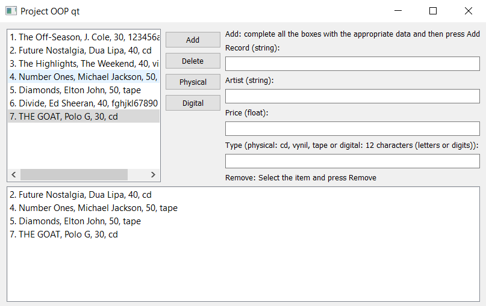

# Music-Shop

## The Program starts with loaded albums from the Load.csv file

#### Loaded Like this:

## The Add button works by typing the name, artist, price and type of a record. When all the data was inserted the add button will add it to the application

### Delete will delete the selected record from the left table

## After that, The Physical and Digital buttons are used to show only the Physical/Digital records

